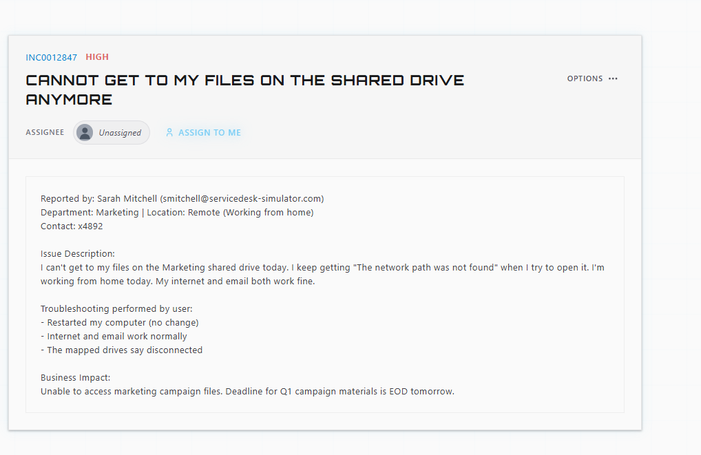
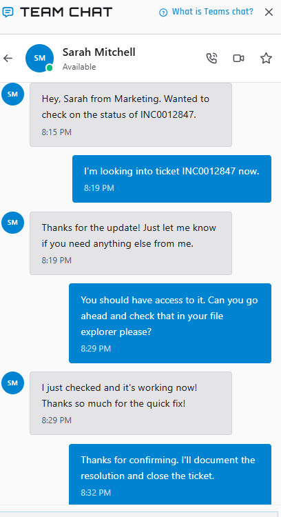

# Shared Drive Access Troubleshooting — INC0012847

## Incident Summary

Sarah Mitchell, a remote Marketing employee, reported that she could no longer access the Marketing shared drive. When she tried to open it, she received a **"The network path was not found"** error.

Her internet and email were working normally, but her mapped network drives showed as disconnected.

The timing made this a high-priority issue: she needed access to marketing campaign files with a Q1 campaign deadline coming up at the end of the next day.

## Troubleshooting Performed

### 1. Established Remote Support

I assigned the ticket to myself and connected to Sarah's workstation through the simulator's remote-support tool.

This allowed me to troubleshoot the issue directly.

### 2. Checked VPN Connectivity

Because Sarah was working remotely and the shared drive was a corporate network resource, I checked the workstation's VPN connection.

The VPN was disconnected.

I reconnected the workstation to the corporate VPN.

### 3. Verified the Marketing Network Drive

After reconnecting the VPN, I checked the mapped drives in File Explorer.

The **D: Marketing Department Drive** was available again.

### 4. Confirmed Resolution With the User

I asked Sarah to check the Marketing drive from her side, rather than assuming that seeing the drive myself meant the problem was completely resolved.

Sarah confirmed that the drive was working and that she could access her files.

## Resolution

**Resolved:** Reconnected the workstation to the corporate VPN, restoring access to the Marketing department's mapped network drive.

**Verification:** The Marketing drive was available in File Explorer, and Sarah confirmed that she could access it.

The important part here was verifying the **actual user outcome**, not just stopping when the VPN changed to "Connected."

## Skills Demonstrated

- Remote desktop support
- VPN troubleshooting
- Network resource troubleshooting
- Mapped network drive troubleshooting
- Windows File Explorer
- Incident prioritization
- Business-impact assessment
- User communication
- Resolution verification
- Incident documentation

## Security Consideration

The issue involved access to a corporate network resource. I used the user's existing authorized workstation access and did not need to request or handle the user's password.

In a production environment, credentials should not be requested or shared through company chat or other informal communication channels.

**Security takeaway:** Solve the access problem without creating a credential problem.

## Outcome

The user's access to the Marketing shared drive was restored, and Sarah confirmed that she could get back to her files.

The technical fix mattered, but so did confirming that the person on the other end could actually get back to work.
