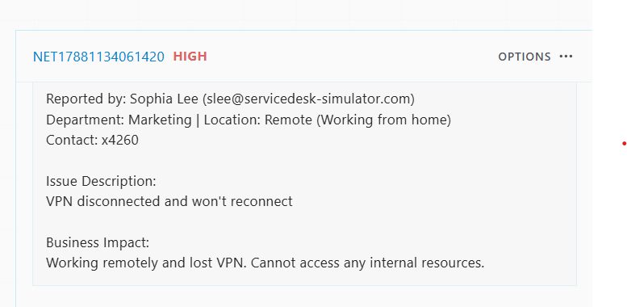
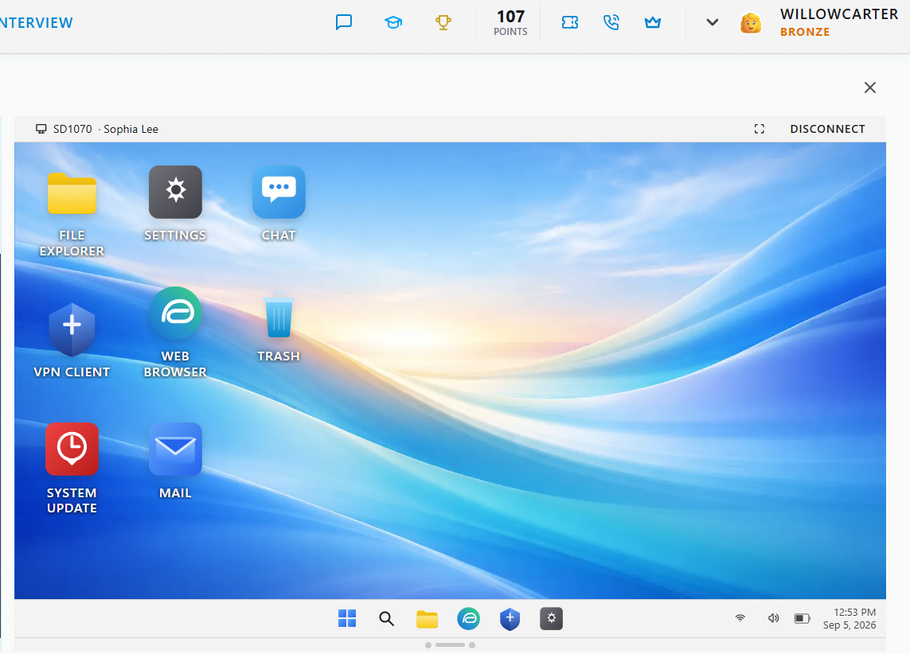
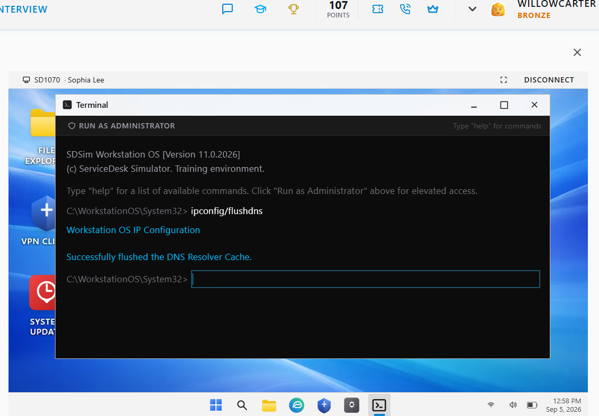
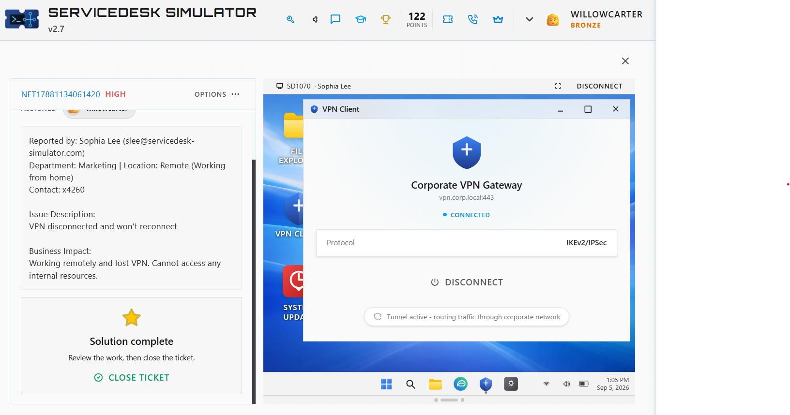

# VPN Troubleshooting — NET17881134061420

## Incident Summary

A remote Marketing employee reported that their corporate VPN had disconnected and would not reconnect. The loss of VPN connectivity prevented access to internal resources.

## Ticket Details

- **Ticket:** NET17881134061420
- **Priority:** High
- **Department:** Marketing
- **Work Location:** Remote
- **Issue:** VPN disconnected and would not reconnect
- **Business Impact:** Unable to access internal resources

## Troubleshooting Performed

### 1. Review the Incident

The ticket indicated that the user was working remotely, had lost VPN connectivity, and could no longer access internal resources.

### 2. Established Remote Support

Connected to the user's workstation using the simulator's remote-support functionality.

### 3. Performed Network Troubleshooting

Opened Terminal and performed network troubleshooting.

The DNS resolver cache was flushed using:

`ipconfig /flushdns`

The command completed successfully.
### 4. Restored VPN Connectivity

After completing the network troubleshooting steps, I reconnected the workstation to the corporate VPN.

The VPN client successfully established an active connection to the corporate VPN gateway.

### 5. Verified Resolution

The VPN connection was verified as active and was routing traffic through the corporate network.

- **Status:** Connected
- **Protocol:** IKEv2/IPSec
- **Tunnel:** Active

The user confirmed that connectivity had been restored.

## Resolution

VPN connectivity was successfully restored, and the user was able to resume access to corporate resources.

## Skills Demonstrated

- Remote support
- VPN troubleshooting
- DNS troubleshooting
- Network diagnostics
- Command-line troubleshooting
- Incident prioritization
- User communication
- Resolution verification
- Ticket documentation
- Security awareness

### Security Observation

The simulated workflow included a request for the user's workstation password through company chat.

> **When this was suggested, my eyebrows hit my hairline. Alarm bells.** 🚨

In a production support environment, a user's password should never be shared through company chat, email, tickets, or other communication channels.

If authentication is required during remote support, I would have the user enter their own credentials directly into the appropriate authentication prompt rather than asking them to disclose their password.

**Security takeaway:** I can troubleshoot the problem without ever needing to know the user's password.

## Evidence

Screenshots documenting the troubleshooting process are stored in the repository's `images` directory.
